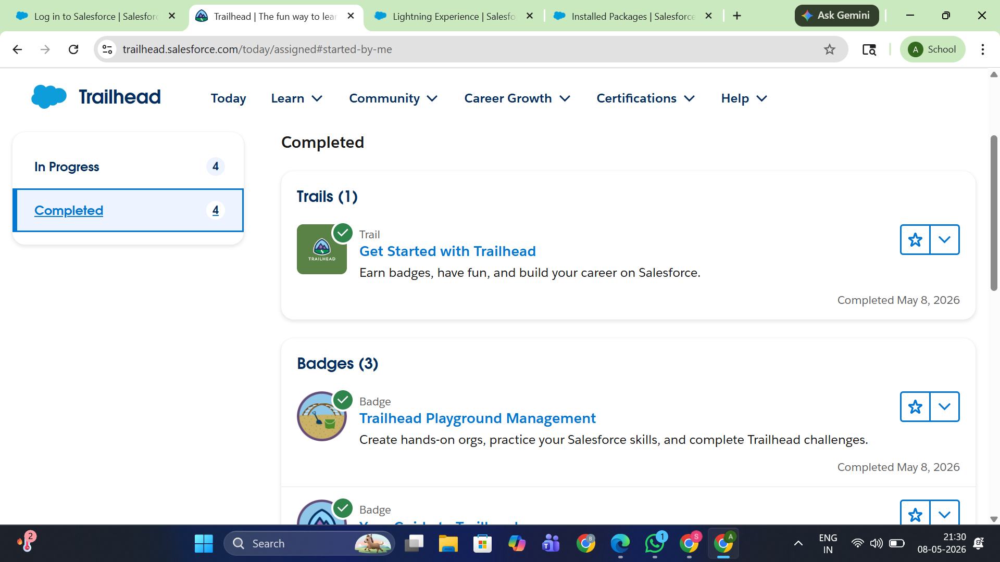
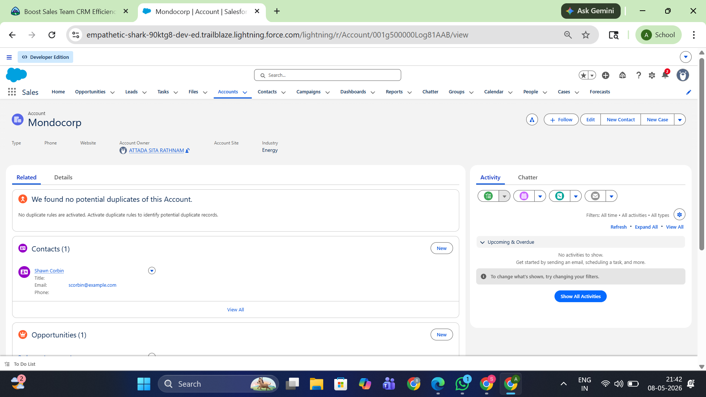
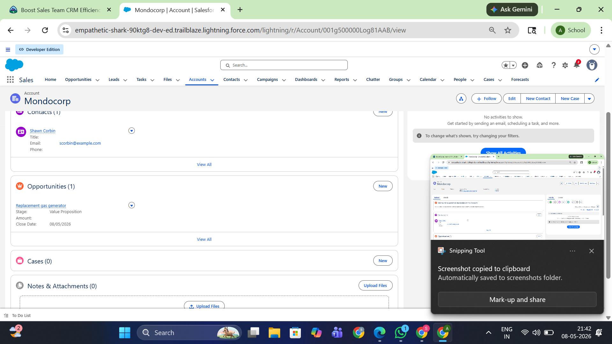

# Salesforce Summer Program - Day 1

## 📌 Topics Covered

- Introduction to Salesforce
- What is CRM
- Salesforce Developer Basics
- Salesforce CRM
- Trailhead Playground Management

---

# ✅ Tasks Completed

- Completed Salesforce Trailhead modules
- Understood CRM workflow
- Learned Account, Contact, and Opportunity concepts
- Created Salesforce Playground
- Explored business workflow process

---

# 🔄 Business Workflow

Lead → Contact → Opportunity → Customer

- Lead: A person interested in a product or service
- Contact: Verified customer information
- Opportunity: Potential business deal
- Customer: Successful completed customer

---

# 🏫 Real-World Mapping (College Admission System)

| Salesforce Concept | Real-World Example |
|-------------------|-------------------|
| Account | College |
| Contact | Student |
| Lead | Student enquiry |
| Opportunity | Admission process |

---

# 📚 Key Learnings

- Understood Salesforce basics
- Learned CRM concepts and workflow
- Learned difference between Account, Contact, and Opportunity
- Understood how businesses use Salesforce
- Learned how to use Trailhead Playground
- Explored customer relationship management process

---

# 📸 Screenshots

## Trailhead Modules Completed

## CRM Learning

---

# 🛠 Tools Used

- Salesforce Trailhead
- Salesforce Playground
- GitHub

---

# 🎯 Outcome

Successfully completed Day 1 tasks and gained basic understanding of Salesforce CRM and business workflow management.
