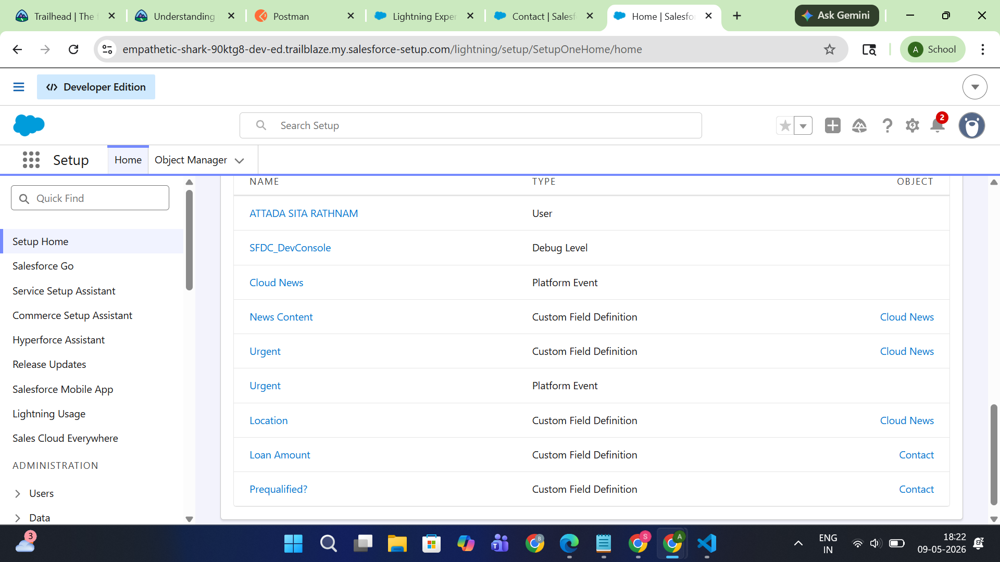

# Salesforce Summer Program - Week 1 Day 2

# 📌 Salesforce Platform Basics

## 1. What is Salesforce Platform?

Salesforce Platform is a cloud-based environment that allows businesses to manage customer relationships, automate workflows, build applications, and store data securely. It provides tools for developers and administrators to create custom solutions using both configuration and coding. The platform includes Apps, Objects, Tabs, APIs, and development tools that help organizations extend Salesforce functionality according to their business needs.

---

# 🔗 Connecting Day 1 + Day 2

CRM concepts like Account, Contact, and Opportunity are stored in Salesforce as Objects. These objects are organized inside Apps so users can easily access and manage business data. For example, in a college admission system, the College can be an Account object, Students can be Contact objects, and the Admission Process can be an Opportunity object. Salesforce Apps provide a user-friendly interface where users interact with these objects through Tabs.

---

# 📘 Important Salesforce Concepts

## What is an App in Salesforce?

An App in Salesforce is a collection of related tabs, objects, and functionalities designed for a specific business purpose. Apps help users organize and access tools required for their work in one place.

### Example:
A College Admission App can contain:
- Student Object
- Admission Object
- Faculty Object
- Course Object

---

## What is an Object?

An Object in Salesforce is a database table used to store information. Each object contains records and fields related to a specific business process.

### Example:
- Student Object
- Course Object
- Admission Object

Objects help store and organize data efficiently.

---

## What is a Tab?

A Tab is a user interface component that allows users to access objects, records, dashboards, or applications easily in Salesforce.

### Example:
The Student Tab opens all student records stored in the Student Object.

---

# ⚖ Difference Between App and Object

| App | Object |
|-----|--------|
| Collection of related features and tabs | Database table storing data |
| Used for organizing functionality | Used for storing records |
| Contains multiple objects | Contains fields and records |
| Example: College Admission App | Example: Student Object |

---

# 🏗 Salesforce Architecture

## What is Multi-Tenant Architecture?

Multi-tenant architecture means multiple organizations share the same Salesforce infrastructure and servers while keeping their data secure and separate. Salesforce manages all customers on a single platform efficiently, reducing maintenance and infrastructure costs.

---

# 👨‍💻 Configuration vs Coding

## What is Configuration?

Configuration means customizing Salesforce using no-code or low-code tools such as:
- Drag and drop
- Process Builder
- Flow Builder
- Object Manager

### When to Use Configuration?
Configuration is used when requirements can be achieved without writing code.

### Examples:
1. Creating custom objects and fields
2. Automating email notifications using Flow Builder

---

## What is Coding (Apex)?

Coding in Salesforce uses Apex programming language and Lightning Components to create advanced functionality and custom business logic.

### When to Use Coding?
Coding is used when business requirements are complex and cannot be achieved using configuration tools alone.

### Examples:
1. Creating custom validation logic
2. Integrating Salesforce with external applications using APIs

---

# 🏫 Real System Thinking (College Admission System)

## App Name
College Admission Management App

---

## Objects Inside the App

- Student Object
- Admission Object
- Course Object
- Faculty Object
- Payment Object

---

## How Users Interact with It

Users log in to the Salesforce App and use Tabs to access different objects. Admission staff can manage student records, process applications, track payments, and monitor admission status. Students’ data is securely stored and connected across related objects for easy management.

---

# 🧠 Developer vs Admin Understanding

## When to Use Clicks (Configuration)?
- Creating fields and objects
- Building workflows and approvals
- Designing reports and dashboards

## When to Use Code (Apex)?
- Complex automation
- External integrations
- Advanced custom business logic

---

# ✍ Evaluation Questions

## 1. What is an App in Salesforce?

An App in Salesforce is a collection of related tools, tabs, and objects designed for a specific business purpose.

---

## 2. What is an Object?

An Object is a database table in Salesforce used to store records and business data.

---

## 3. Difference between App and Object

An App organizes functionality and contains multiple objects, while an Object stores specific business data in the form of records and fields.

---

## 4. What is Multi-Tenant Architecture?

Multi-tenant architecture is a system where multiple organizations share the same Salesforce platform and infrastructure securely.

---

## 5. When should we use Configuration instead of Code?

Configuration should be used when business requirements can be achieved using built-in Salesforce tools without programming.

---

## 6. How does Salesforce allow developers to extend functionality?

Salesforce allows developers to extend functionality using Apex programming, APIs, Lightning Components, and custom applications.

---

# 📸 Screenshots

## Trailhead Modules Completed

## Salesforce Platform Basics

## Development Basics

---

# 📚 Key Learnings

- Learned Salesforce platform structure
- Understood Apps, Objects, and Tabs
- Learned Salesforce architecture basics
- Understood multi-tenant architecture
- Learned difference between configuration and coding
- Understood how developers extend Salesforce functionality

---

# 🛠 Tools Used

- Salesforce Trailhead
- Salesforce Playground
- GitHub

---

# 🎯 Outcome

Successfully understood how Salesforce platform works internally, how CRM concepts fit into the platform, and how developers build and extend Salesforce applications.
