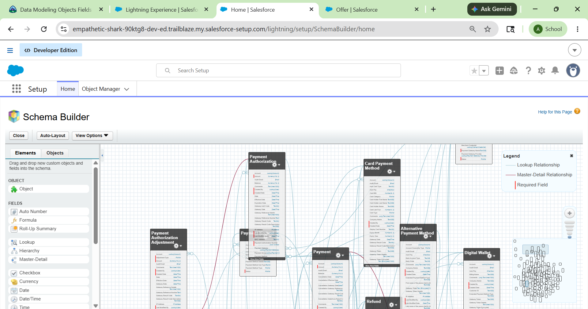
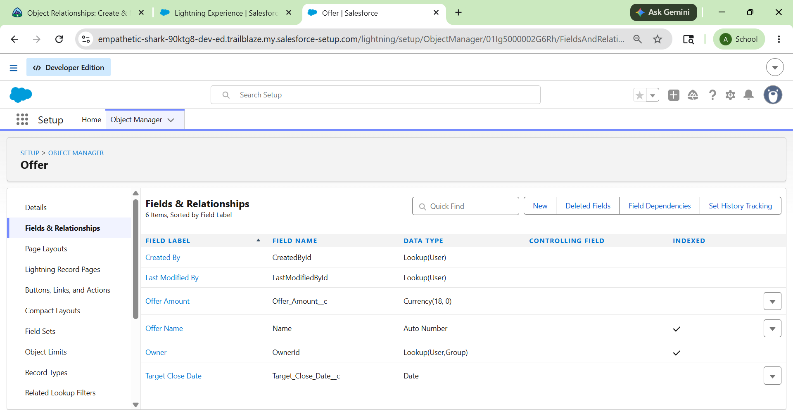
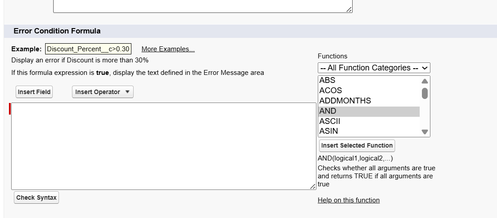
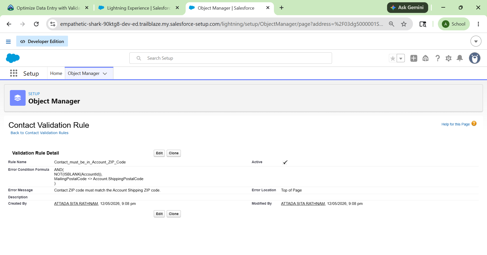

# Salesforce Summer Program - Week 1 Day 3

# 📌 Topics Covered

- Schema Builder
- Data Modeling
- Object Relationships
- Formula Fields
- Validation Rules
- Custom Objects and Fields

---

# 🧩 What is Schema Builder?

Schema Builder is a Salesforce tool used to visualize, design, and manage the data model of an application. It provides a graphical interface where developers and administrators can create objects, fields, and relationships easily.

Schema Builder helps in:
- Understanding data relationships
- Designing complex systems visually
- Creating custom objects and fields
- Managing relationships between objects

---

# ✅ Advantages of Schema Builder

- Easy visualization of objects and relationships
- Drag-and-drop interface
- Simplifies data modeling
- Helps explain system architecture clearly
- Quick creation of custom objects and fields

---

# 🏗 Working with Schema Builder

## Objects Used

- Contact
- Favorite
- Offer
- Property

Using Schema Builder, these objects were visualized and arranged using Auto-Layout to understand how data flows throughout the system.

---

# 🆕 Create Object Using Schema Builder

A custom object can be created directly in Schema Builder by:
1. Opening Schema Builder
2. Selecting the Elements tab
3. Dragging the Object element onto the canvas
4. Entering object details
5. Saving the object

### Example Custom Object
- Student
- Property
- Favorite

---

# 📝 Create Fields Using Schema Builder

Fields can also be created visually by:
1. Selecting a field type
2. Dragging it onto an object
3. Configuring field details
4. Saving the field

### Field Types
- Text
- Number
- Formula
- Lookup Relationship
- Master-Detail Relationship

---

# 🔗 Object Relationships in Salesforce

Object relationships connect objects together and help organize related data efficiently.

## Types of Relationships

### 1. Lookup Relationship

A lookup relationship loosely connects two objects.

### Example:
- Contact linked to Favorite
- Account linked to Contact

### Features:
- Objects can exist independently
- One-to-one or one-to-many relationship

---

## 2. Master-Detail Relationship

A master-detail relationship tightly connects objects where the detail object depends on the master object.

### Example:
- Property → Favorite

### Features:
- Child record depends on parent record
- Deleting master deletes related detail records
- Controls security and ownership

---

# 🏠 DreamHouse Example

## Favorite Object

A custom object called Favorite was created to track users who marked properties as favorites.

### Relationships Created

| Relationship Type | Objects |
|-------------------|----------|
| Lookup Relationship | Favorite → Contact |
| Master-Detail Relationship | Favorite → Property |

This allows Salesforce to track:
- Which contact liked a property
- Which properties are marked as favorites

---

# 🧮 Formula Fields

Formula Fields automatically calculate values based on formulas and display results dynamically.

Formula fields help:
- Automate calculations
- Display related object data
- Reduce manual work

---

# 🛠 Formula Editor Features

- Insert Field
- Insert Operator
- Functions Menu
- Check Syntax
- Advanced Formula Editor

---

# 📘 Formula Field Examples

## 1. Account Number Formula

Displays the account number on the Contact page using a cross-object formula.

```formula
Account.AccountNumber
```

---

## 2. Days to Close Formula

Calculates the number of days until an Opportunity closes.

```formula
CloseDate - TODAY()
```

---

## 3. Discount Formula

Applies a 12% discount to an Opportunity Amount.

```formula
ROUND(Amount - (Amount * 0.12), 2)
```

---

# 🧠 Common Formula Errors

- Missing parentheses
- Incorrect parameter types
- Wrong number of parameters
- Invalid field references
- Unsupported functions

The Check Syntax button helps identify formula issues before saving.

---

# ✅ Validation Rules

Validation Rules ensure that users enter correct and valid data before saving records.

Validation rules:
- Improve data quality
- Prevent invalid entries
- Display custom error messages

---

# 🛠 Validation Rule Components

- Rule Name
- Error Condition Formula
- Error Message
- Error Location

---

# 📘 Validation Rule Example

## Account Number Validation

Ensures the account number contains exactly 8 characters.

```formula
LEN(AccountNumber) <> 8
```

### Error Message
```text
Account number must be 8 characters long.
```

---

# 📚 Additional Validation Rule Examples

## Numeric Account Number

```formula
AND(
   NOT(ISBLANK(AccountNumber)),
   NOT(ISNUMBER(AccountNumber))
)
```

---

## Current Year Date Validation

```formula
YEAR(My_Date__c) <> YEAR(TODAY())
```

---

## Salary Range Validation

```formula
(Salary_Max__c - Salary_Min__c) > 20000
```

---

# 🏫 Real-World Understanding (College Admission System)

## Objects

- Student
- Course
- Admission
- Faculty

## Relationships

| Object | Relationship |
|--------|--------------|
| Student → Admission | Lookup |
| Admission → Course | Master-Detail |

## Validation Example

Ensure student phone numbers contain exactly 10 digits.

---

# 📸 Screenshots

## Schema Builder


## Object Relationships


## Formula Field


## Validation Rule


---

# 📚 Key Learnings

- Learned visual data modeling using Schema Builder
- Understood Lookup and Master-Detail relationships
- Created custom objects and fields
- Learned Formula Fields and formulas
- Understood Validation Rules and error handling
- Explored Salesforce data architecture deeply

---

# 🛠 Tools Used

- Salesforce Trailhead
- Salesforce Playground
- Schema Builder
- GitHub

---

# 🎯 Outcome

Successfully learned Salesforce data modeling concepts including Schema Builder, object relationships, formula fields, and validation rules while understanding how Salesforce manages complex business data efficiently.
