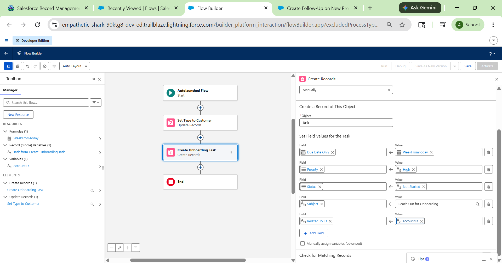
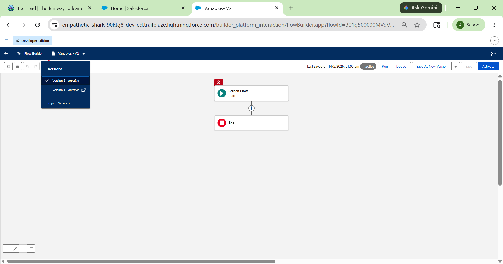
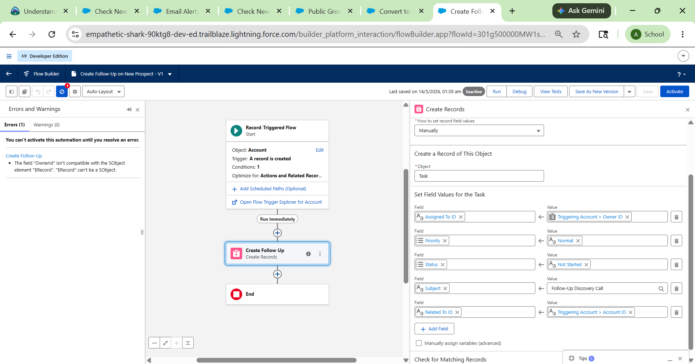
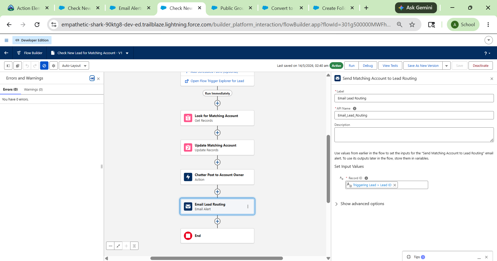
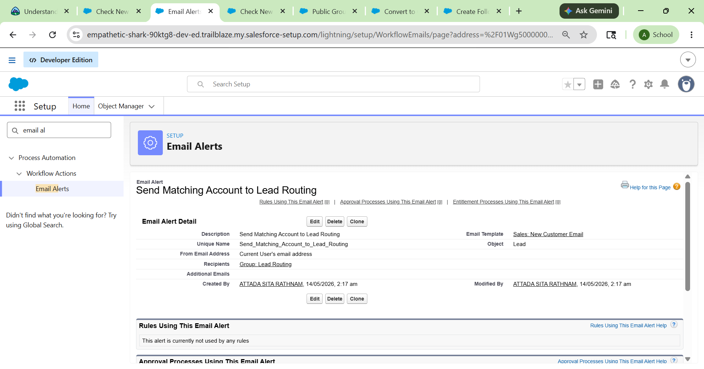

# Salesforce Summer Program - Week 1 Day 4

# 📌 Topics Covered

- Salesforce Flow
- Flow Builder
- Variables and Resources
- Record-Triggered Flows
- Create, Update, and Get Records
- Action Elements
- Chatter Notifications
- Email Alerts
- Global Variables
- Custom Labels and Metadata

---

# 🌊 What is Salesforce Flow?

Salesforce Flow is an automation tool that helps automate business processes using clicks instead of code. Flows can create, update, delete, and retrieve records, send emails, post Chatter messages, and automate tasks inside Salesforce.

Flow Builder is the main tool used to design and build flows visually using drag-and-drop elements.

---

# 🛠 Flow Builder Components

## 1. Toolbox
Contains all flow elements and resources such as variables, formulas, and text templates.

## 2. Canvas
The working area where flows are visually designed using elements and connectors.

## 3. Button Bar
Used for:
- Save
- Activate
- Debug
- Run
- View Errors
- Settings

---

# 🧩 Building Blocks of Flow

## Elements
Flow elements perform actions inside the flow.

### Types of Elements

### Interaction Elements
- Screen
- Action
- Subflow

### Data Elements
- Get Records
- Create Records
- Update Records
- Delete Records

### Logic Elements
- Assignment
- Decision
- Loop

---

## Connectors
Connectors define the path the flow follows during execution.

---

## Resources
Resources store values and information used in flows.

Examples:
- Variables
- Constants
- Formulas
- Text Templates

---

# 📦 Variables in Flow Builder

Variables are containers used to store data temporarily during flow execution.

## Variable Types

| Type | Example |
|------|---------|
| Text | Name, Email |
| Number | 100 |
| Boolean | True / False |
| Date | 2026-05-13 |
| Record | Account Record |

---

# 🧮 Formula Resources

Formula resources calculate values dynamically inside flows.

### Example Formula

```formula
TODAY() + 7
```

This formula calculates a date one week from today.

---

# 📝 Text Templates

Text Templates store formatted text used in:
- Emails
- Chatter Posts
- Notifications

Text templates can include merge fields and variables.

---

# 🔄 Working with Salesforce Records in Flows

Flows interact with Salesforce data using Data Elements.

---

# ➕ Create Records

The Create Records element creates new Salesforce records automatically.

### Example:
Automatically create a follow-up Task when a new Prospect Account is created.

---

# ✏ Update Records

The Update Records element modifies existing records.

### Example:
Copy Account Phone Number to a Contact if the Contact phone field is empty.

---

# 🔍 Get Records

The Get Records element retrieves Salesforce records based on conditions.

### Example:
Retrieve the latest Decision Maker contact related to an Opportunity.

---

# ❌ Delete Records

The Delete Records element removes Salesforce records when required.

---

# 🔗 Combining Variables and Data Elements

Flows use variables generated by elements such as:
- Get Records
- Create Records
- Update Records

These variables help pass data between flow elements.

---

# 📢 Communicate Using Action Element

The Action Element is used for:
- Sending Emails
- Posting to Chatter
- Submitting Approval Requests
- Sending Notifications

---

# 📧 Email Alerts

Flows can send automated emails using Email Alert actions.

### Example:
Notify Account Owners when Account details change.

---

# 💬 Chatter Posts

Flows can automatically create Chatter posts to notify users.

### Example:
Post a notification to the Account Owner when a matching Lead is found.

---

# ✅ Hands-On Challenges Completed

---

# 1. Create Follow-Up on New Prospect

### Flow Logic

```text
New Prospect Account Created
↓
Automatically Create Follow-Up Task
```

### Features
- Record-Triggered Flow
- Create Records Element
- Task Automation

---

# 2. Copy Account Phone to New Contact

### Flow Logic

```text
New Contact Created
↓
Check if Phone is Empty
↓
Copy Account Phone
```

### Features
- Update Records Element
- Triggering Record Variable

---

# 3. Convert Account to Customer

### Flow Logic

```text
Update Account Type
↓
Create Onboarding Task
```

### Features
- Formula Resource
- Create Records
- Update Records

---

# 4. Check New Lead for Matching Account

### Flow Logic

```text
New Lead Created
↓
Find Matching Account
↓
Update Lead Lookup Field
```

### Features
- Get Records
- Update Records
- Lookup Relationships

---

# 5. Add Chatter and Email to Lead Flow

### Flow Logic

```text
New Lead Created
↓
Find Matching Account
↓
Update Matching Account
↓
Post Chatter Notification
↓
Send Email Alert
```

### Features
- Text Templates
- Chatter Actions
- Email Alerts
- Public Groups

---

# 🌍 Global Variables in Flow Builder

Global Variables provide system information during flow execution.

Examples:
- Running User
- Running User’s Profile
- Running User’s Role
- Triggering Record
- Current Date
- Current DateTime

---

# 👤 Running User Global Variable

Used to access:
- User Name
- Email
- Manager
- Role
- Profile

### Example Use Case
Notify Opportunity Owner’s Manager when an Opportunity is marked Closed Lost.

---

# 🏷 Custom Labels

Custom Labels store reusable text that supports multiple languages.

Used in:
- Emails
- Screens
- Notifications

---

# 🗂 Custom Metadata

Custom Metadata stores reusable configuration data across Salesforce.

Accessed using:
- Get Records Element

---

# 📚 Quiz Answers

## 1. Which global variable contains the name of the running user’s profile?

Answer:
Running User’s Profile

---

## 2. What do you use to access custom metadata types in Flow Builder?

Answer:
Get Records Element

---

# 🏫 Real-World Understanding (College Admission System)

## Example Automation

### Admission Process Flow

```text
Student Enquiry Created
↓
Check Existing Student Records
↓
Create Admission Task
↓
Notify Admission Team
↓
Update Admission Status
```

### Objects Used
- Student
- Admission
- Course
- Faculty

### Automation Used
- Record Triggered Flows
- Email Alerts
- Chatter Notifications
- Validation Rules

---

# 📸 Screenshots

## Flow Builder Interface


## Variables and Resources


## Create Records Flow


## Chatter Action


## Email Alert


---

# 📚 Key Learnings

- Learned Salesforce Flow fundamentals
- Understood Flow Builder architecture
- Learned variables and resources
- Worked with Create, Update, and Get Records
- Built automated business processes
- Learned Chatter and Email automation
- Understood Global Variables
- Explored Action Elements deeply

---

# 🛠 Tools Used

- Salesforce Trailhead
- Salesforce Playground
- Flow Builder
- GitHub

---

# 🎯 Outcome

Successfully learned Salesforce Flow Builder concepts including variables, resources, data elements, global variables, Chatter actions, email alerts, and automation workflows by building multiple real-world business process automations.
