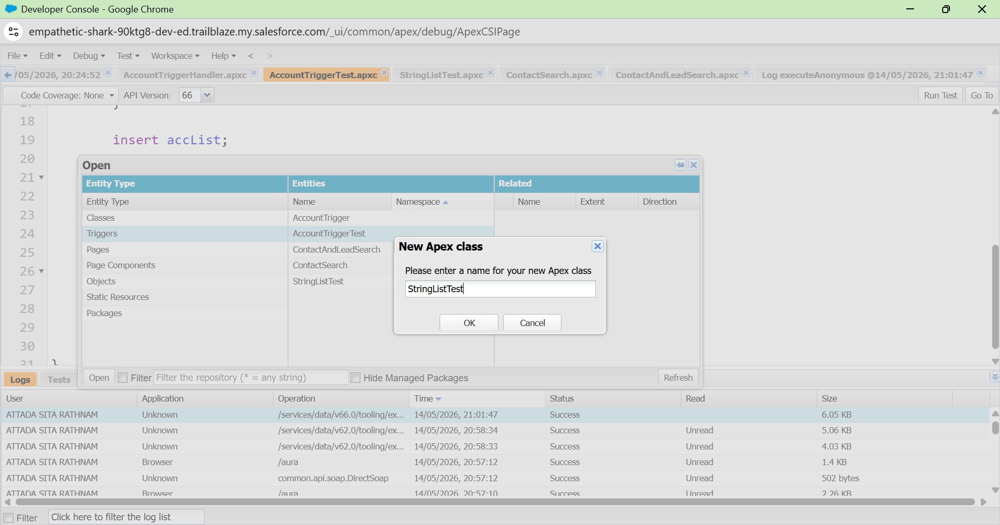
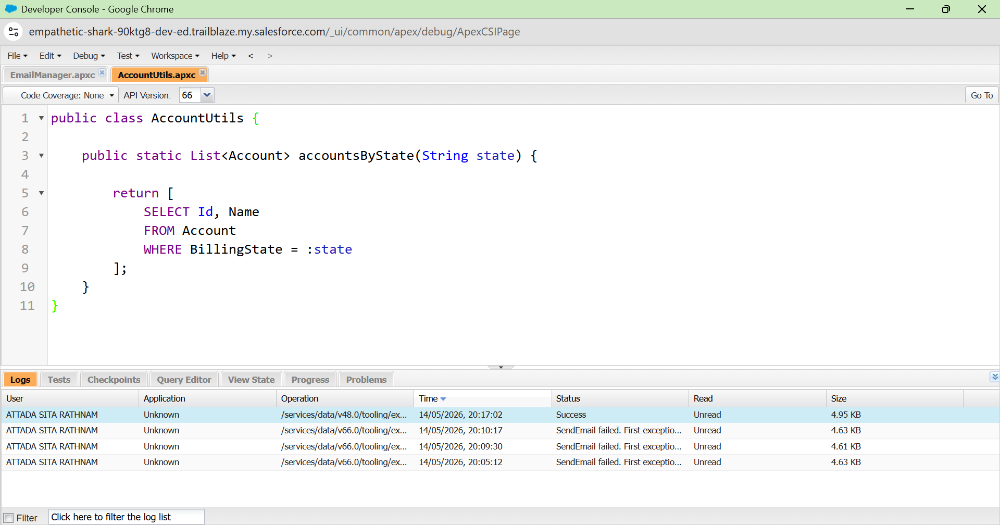
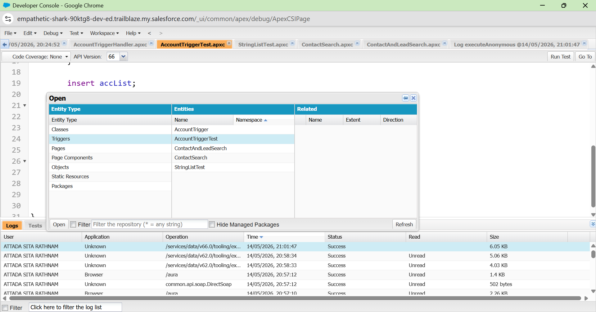
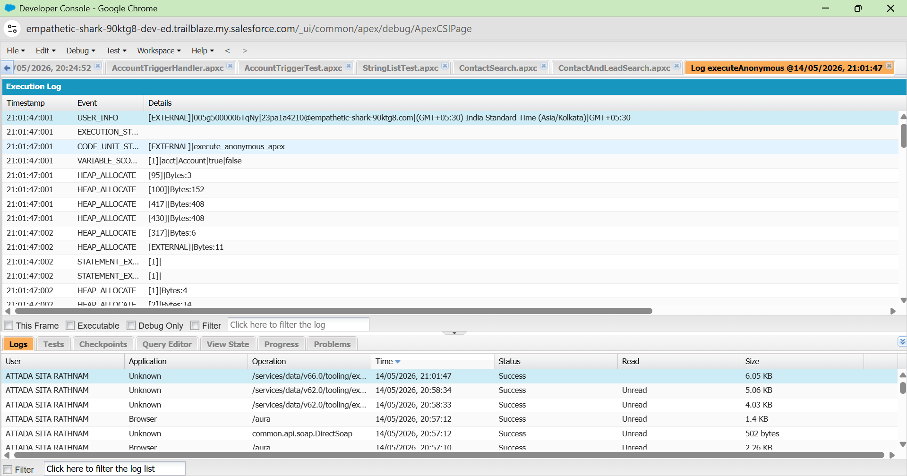

# Salesforce Summer Program - Week 1 Day 5

# 📌 Topics Covered

- Introduction to Apex
- Apex Syntax and Structure
- Variables and Data Types
- Conditional Statements
- Loops in Apex
- Classes and Methods
- DML Operations
- SOQL Queries
- Triggers
- Exception Handling
- Declarative vs Programmatic Development

---

# 🚀 What is Apex?

Apex is a strongly typed, object-oriented programming language developed by Salesforce. It is used to add custom business logic and advanced automation inside the Salesforce platform. Apex allows developers to create complex functionalities that cannot be achieved using only clicks, flows, or configuration tools.

Apex runs on Salesforce servers and is tightly integrated with Salesforce database operations such as SOQL and DML.

---

# 🧠 Why Apex is Needed?

Salesforce provides many no-code tools like:
- Flows
- Validation Rules
- Process Automation

But some enterprise-level business requirements are too complex for declarative tools alone.

Apex helps developers:
- Handle complex calculations
- Integrate external systems
- Create custom automation
- Process large data efficiently
- Build advanced business logic

---

# ⚖️ Difference Between Flow and Apex

| Flow | Apex |
|------|------|
| No-code automation | Code-based automation |
| Easy to build | Requires programming |
| Best for simple logic | Best for complex logic |
| Drag-and-drop interface | Written using Apex syntax |
| Faster development | More flexible and powerful |

---

# ⚙️ Difference Between Configuration and Coding

| Configuration | Coding |
|--------------|--------|
| Uses clicks and setup tools | Uses programming language |
| Easy to maintain | Requires developer knowledge |
| Suitable for simple requirements | Suitable for advanced logic |
| Faster implementation | More customization possible |

---

# 🏫 Integrated College Management System

## CRM Concept

The College Management System uses Salesforce CRM concepts to manage student admissions, courses, faculty details, and academic workflows efficiently.

---

# 📦 Objects Used

| Object | Purpose |
|------|---------|
| Student | Stores student details |
| Course | Stores course information |
| Faculty | Stores faculty details |
| Admission | Tracks admission process |

---

# 🔗 Relationships

- Student ↔ Course
- Faculty ↔ Course
- Student ↔ Admission

These relationships help connect related records and maintain proper data organization.

---

# ✅ Validation Rules

Validation Rules ensure data accuracy.

### Examples:
- Student email must not be empty
- Phone number should contain valid digits
- Attendance cannot exceed 100%

---

# 🧮 Formula Fields

Formula fields automatically calculate values.

### Example:
```formula
Remaining Seats = Total Seats - Filled Seats
```

---

# 🔄 Flows Used

Flows automate repetitive business processes.

### Examples:
- Auto-send admission confirmation email
- Create follow-up tasks
- Notify faculty when attendance is low
- Update student admission status automatically

---

# 💻 Apex Usage in the System

Apex is used when flows are not enough.

### Examples:
- Complex fee calculation
- External payment integration
- Advanced eligibility verification

---

# 🔥 Real Examples Where Apex Is Needed

## 1. Complex Fee Calculation

Different fee structures may apply based on:
- Scholarship
- Category
- Hostel
- Transport

This logic becomes too complex for Flows.

### Why Apex?
Apex handles advanced calculations efficiently using custom logic.

---

## 2. External Payment Gateway Integration

The system may need to connect with:
- Razorpay
- Stripe
- Banking APIs

### Why Apex?
Flows cannot fully handle advanced external API integrations securely.

---

## 3. Advanced Eligibility Logic

Example:
- Attendance > 75%
- Fee Paid
- No Backlogs
- Minimum CGPA

Only eligible students can register for placements.

### Why Apex?
Complex multiple-condition validation is easier and more scalable in Apex.

---

# 🔤 Apex Programming Concepts Learned

---

# 📌 Variables

Variables store temporary data.

### Example:
```apex
String studentName = 'Sita';
Integer marks = 95;
```

---

# 📌 Conditional Statements

Used for decision-making.

### Example:
```apex
if(marks > 75){
    System.debug('Eligible');
}
```

---

# 📌 Loops

Loops repeat logic multiple times.

### Example:
```apex
for(Integer i=0; i<5; i++){
    System.debug(i);
}
```

---

# 📌 Classes

Classes contain methods and logic.

### Example:
```apex
public class StudentHandler {

}
```

---

# 📌 SOQL

SOQL is used to retrieve Salesforce records.

### Example:
```apex
SELECT Id, Name FROM Student__c
```

---

# 📌 DML Operations

DML operations manipulate Salesforce data.

### Examples:
- insert
- update
- delete

---

# 📌 Triggers

Triggers automatically execute Apex code during database events.

### Example:
```apex
before insert
after update
```

---

# 📌 Exception Handling

Exception handling prevents system crashes during errors.

### Example:
```apex
try{

}
catch(Exception e){

}
```

---

# 🧠 Apex Thinking Exercise

## Cases Where Flow Is NOT Enough

### 1. Fee Calculation Engine
Complex fee logic involving discounts, scholarships, hostel fees, and taxes requires Apex.

### 2. External System Integration
Connecting Salesforce with online payment gateways or ERP systems needs Apex APIs.

### 3. Advanced Student Eligibility Logic
Multiple dependent conditions and validations are easier to handle using Apex programming.

---

# 📝 Pseudocode Examples

---

## Example 1 — Seat Availability

```text
IF seats are full
THEN block student registration
```

---

## Example 2 — Attendance Check

```text
IF attendance < 75%
THEN notify student and faculty
```

---

## Example 3 — Fee Due Notification

```text
IF fee payment is pending
THEN send reminder email
```

---

## Example 4 — Placement Eligibility

```text
IF CGPA > 7 AND no backlogs
THEN allow placement registration
ELSE block registration
```

---

# 🤔 Reflection

Enterprise systems cannot rely only on clicks and configuration because business requirements become more complex as organizations grow. Declarative tools are powerful for simple automation, but advanced scenarios require programming flexibility, external integrations, custom algorithms, and scalable logic handling.

Apex provides developers with complete control over business logic, security, performance optimization, and integrations. Therefore, modern enterprise systems usually combine both declarative tools and programmatic development for building efficient and scalable applications.

---

# ✍️ Reflective Questions & Answers

---

## 1. Why is Apex needed if Salesforce already has Flows?

Flows are suitable for simple automation, but Apex is needed for advanced business logic, integrations, and complex calculations.

---

## 2. When should developers prefer no-code solutions?

Developers should prefer no-code solutions when requirements are simple, maintainable, and can be achieved using Flows or configuration tools.

---

## 3. What problems require custom programming?

Complex calculations, external integrations, advanced validations, and scalable automation require custom programming.

---

## 4. Why is business logic important in enterprise systems?

Business logic ensures that processes follow organizational rules, improve automation, and maintain data consistency.

---

## 5. Why should developers avoid unnecessary coding?

Unnecessary coding increases maintenance complexity, development time, and debugging effort.

---

## 6. How does programming increase flexibility?

Programming allows developers to create fully customized solutions, handle complex scenarios, and integrate with external systems.

---

# 📸 Screenshots

## Apex Class Creation


## SOQL Query Execution


## Trigger Example


## Apex Execution


---

# 📚 Key Learnings

- Understood why Apex exists in Salesforce
- Learned declarative vs programmatic development
- Worked with Apex syntax and structure
- Learned SOQL and DML operations
- Understood Triggers and Exception Handling
- Connected CRM concepts with Apex logic
- Explored real-world enterprise use cases

---

# 🛠 Tools Used

- Salesforce Trailhead
- Salesforce Developer Console
- Apex Programming
- SOQL
- Salesforce Playground
- GitHub

---

# 🎯 Outcome

Successfully understood how Apex programming extends Salesforce functionality beyond clicks and flows, enabling advanced business logic, enterprise integrations, scalable automation, and custom application development.
