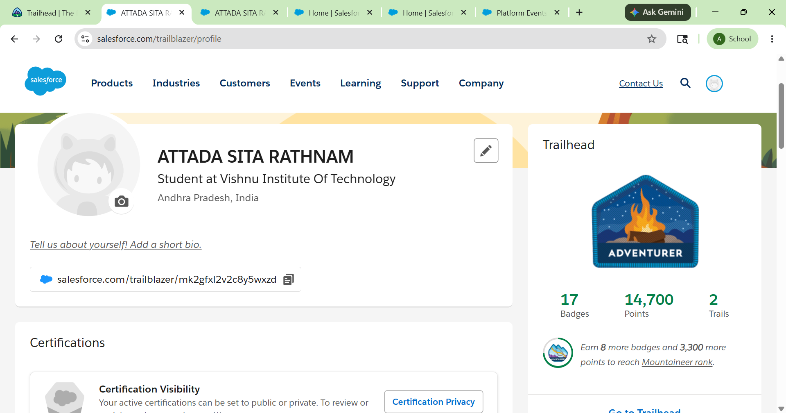
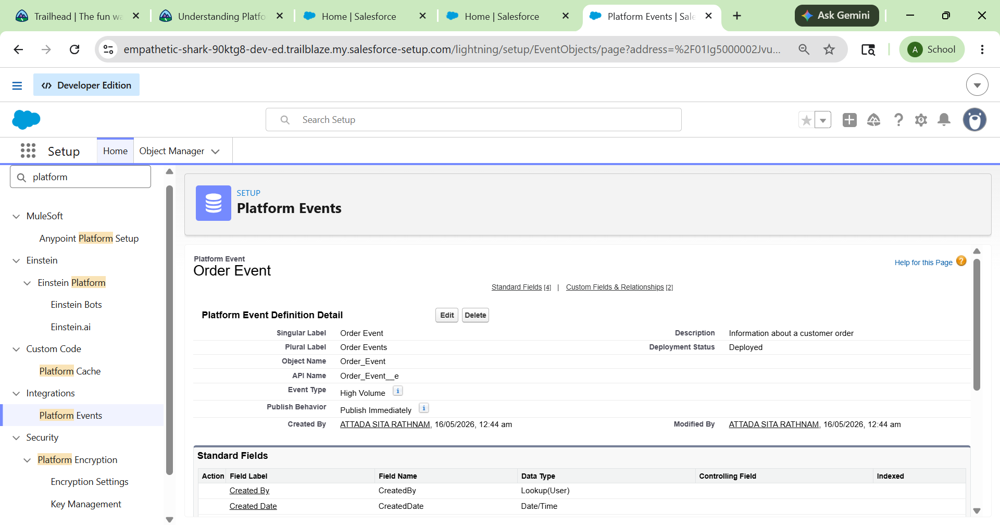
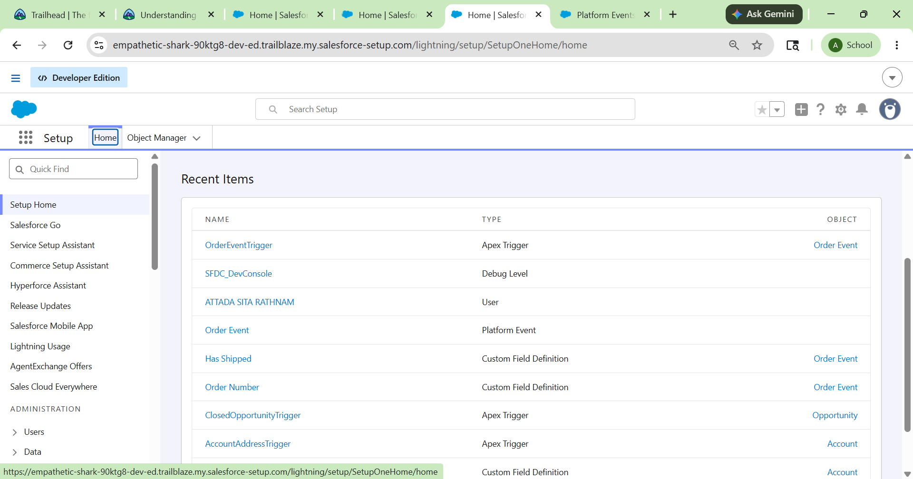

# Salesforce Summer Program - Light Completion Day

# 📌 Topics Covered

- Salesforce Search Basics
- Platform Events Basics
- Salesforce CLI Introduction
- Event-Driven Architecture
- Developer Workflow Basics

---

# ✅ Modules Completed

## 1. Search Solution Basics
Learned how Salesforce search works internally and how users can quickly find records using optimized search functionality.

---

## 2. Agentforce 360 Platform Events Basics
Learned about Platform Events, event-driven systems, and how systems communicate asynchronously using notifications and events.

---

## 3. Command-Line Interface (CLI)
Learned why developers use command-line tools for faster development, deployment, and project management workflows.

---

# 📚 Key Learnings

---

## 🔍 Search Solution Basics

### Learning:
Fast and optimized search improves productivity by helping users retrieve records and important business data quickly.

---

## ⚡ Platform Events Basics

### Learning:
Platform Events allow systems to communicate automatically using event-driven architecture and asynchronous processing.

---

## 💻 Salesforce CLI Basics

### Learning:
CLI tools help developers automate tasks, manage projects efficiently, and work faster compared to manual clicking.

---

# 🌍 Platform Event Thinking

### Real-Life Example

When a student completes fee payment:
- Finance system receives payment update
- Admission system updates payment status
- Student receives confirmation email
- Admin dashboard updates automatically

This is an example of one event notifying multiple systems simultaneously.

---

# 💡 CLI Reflection

Developers prefer command-line tools because they are faster, support automation, and improve productivity. CLI tools also help manage deployments, projects, and version control efficiently without repeatedly navigating through multiple UI screens.

---

# 🔎 Search Reflection

Fast and accurate search is important in enterprise systems because organizations manage huge amounts of data daily. Efficient search helps users quickly access required information, improves productivity, and reduces operational delays.

---

# ❓ One Doubt / Question

How do large enterprise systems handle millions of real-time platform events efficiently without affecting performance?

---

# 📸 Screenshots

## Trailhead Progress

## Platform Events Module

## Search Basics

---

# 🛠 Tools Used

- Salesforce Trailhead
- Salesforce CLI
- Salesforce Platform Events
- Salesforce Search
- GitHub

---

# 🎯 Outcome

Successfully gained high-level understanding of:
- Enterprise search systems
- Event-driven architecture
- Salesforce CLI workflow
- Developer productivity tools
- Platform event communication systems
