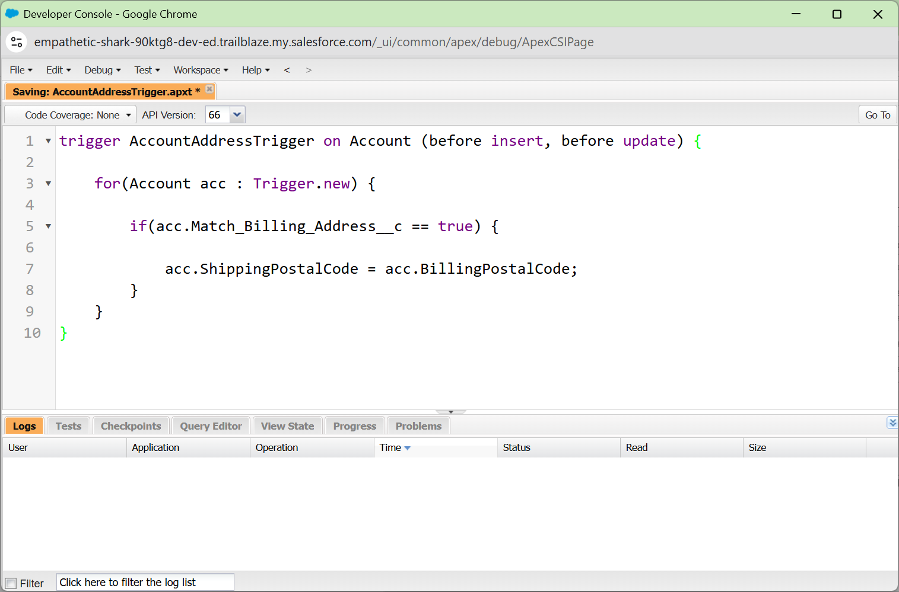
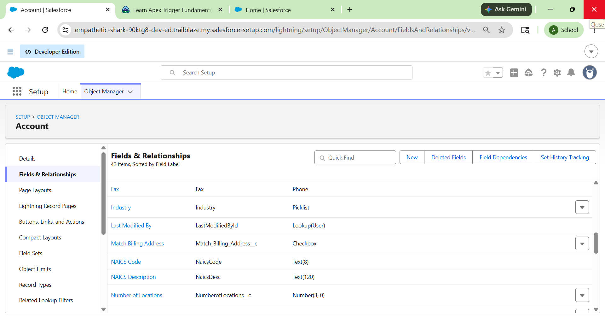

# Salesforce Summer Program - Week 1 Day 6

# 📌 Topics Covered

- Salesforce Database Concepts
- SOQL (Salesforce Object Query Language)
- SOSL (Salesforce Object Search Language)
- DML Operations
- Apex Triggers
- Before vs After Triggers
- Event-Driven Systems
- Flow vs Trigger
- Business Automation Logic

---

# 🗄 What is SOQL?

SOQL (Salesforce Object Query Language) is a query language used in Salesforce to retrieve records from the Salesforce database. It is similar to SQL but designed specifically for Salesforce objects and relationships.

SOQL helps developers:
- Retrieve records
- Filter data
- Access related objects
- Build business logic using database information

---

# 🔍 Example SOQL Query

```sql
SELECT Id, Name FROM Student__c
```

This query retrieves the ID and Name fields from the Student object.

---

# 🔎 What is SOSL?

SOSL (Salesforce Object Search Language) is used to search text across multiple Salesforce objects at the same time.

### Example:
```sql
FIND 'Smith' IN ALL FIELDS RETURNING Contact, Lead
```

This query searches for the word "Smith" in Contacts and Leads.

---

# 💾 DML Operations

DML (Data Manipulation Language) operations are used to manipulate Salesforce records.

## Common DML Operations

| Operation | Purpose |
|-----------|---------|
| insert | Create records |
| update | Modify records |
| delete | Remove records |
| undelete | Restore deleted records |

---

# ⚡ What is an Apex Trigger?

An Apex Trigger is Apex code that automatically executes when specific events occur on Salesforce records.

Triggers help systems react automatically to data changes.

### Examples:
- Before Insert
- After Update
- Before Delete
- After Insert

---

# 🔄 Trigger Lifecycle

```text
Record Created/Updated
↓
Trigger Fires
↓
Business Logic Executes
↓
Database Updated
```

---

# ⚖ Difference Between Before and After Trigger

| Before Trigger | After Trigger |
|----------------|---------------|
| Executes before saving record | Executes after saving record |
| Used for validation and field updates | Used for related records and notifications |
| Faster execution | Used when record ID is required |

---

# ⚖ Difference Between Flow and Trigger

| Flow | Apex Trigger |
|------|---------------|
| Declarative automation | Programmatic automation |
| No-code solution | Requires Apex coding |
| Easier to maintain | More flexible and powerful |
| Best for simple automation | Best for complex business logic |
| Drag-and-drop interface | Event-driven coding |

---

# 🏫 College Management System – Trigger Thinking

## 1. After Student Registration → Send Welcome Email

### Trigger Event
After Insert on Student object

### Action
Automatically send admission confirmation email to student.

### Preferred Tool
Flow

### Why?
Simple email automation can be easily handled using Flow.

---

## 2. After Course Becomes Full → Notify Faculty

### Trigger Event
After Update on Course object

### Action
Notify faculty that seats are full.

### Preferred Tool
Flow

### Why?
Simple notifications and updates are suitable for declarative automation.

---

## 3. After Attendance Drops Below 75% → Send Warning

### Trigger Event
After Update on Attendance object

### Action
Send warning notification to student and parents.

### Preferred Tool
Flow

### Why?
Condition-based notifications are easier using Flows.

---

## 4. After Fee Payment → Verify Scholarship Eligibility

### Trigger Event
After Update on Payment object

### Action
Run complex scholarship eligibility calculations.

### Preferred Tool
Apex Trigger

### Why?
Complex calculations and multiple validations require Apex logic.

---

## 5. After Placement Registration → Check Eligibility Rules

### Trigger Event
Before Insert on Placement object

### Action
Validate:
- CGPA
- Backlogs
- Attendance
- Fee Status

### Preferred Tool
Apex Trigger

### Why?
Complex business rules and validations are better handled using Apex.

---

# 🧠 Flow vs Trigger Thinking

---

## 1. Simple Email Notification

### Preferred:
Flow

### Why?
Easy to configure without coding.

---

## 2. Complex Fee Eligibility Check

### Preferred:
Apex Trigger

### Why?
Requires advanced calculations and multiple conditions.

---

## 3. Updating Related Records

### Preferred:
Flow

### Why?
Flows efficiently handle related record updates.

---

## 4. External API Integration

### Preferred:
Apex Trigger

### Why?
External API calls and integrations require programming logic.

---

# 🔍 Query Thinking (English Query Examples)

---

## Query 1

```text
Find all students enrolled in Course A
```

---

## Query 2

```text
Find all courses handled by Faculty X
```

---

## Query 3

```text
Find students whose attendance is below 75%
```

---

## Query 4

```text
Find students who have pending fee payments
```

---

## Query 5

```text
Find faculty members assigned to the Computer Science department
```

---

# ⚡ Real Trigger Examples Learned

---

# 1. Account Address Trigger

### Purpose
Copy Billing Postal Code to Shipping Postal Code when checkbox is selected.

### Event
Before Insert and Before Update

---

# 2. Closed Opportunity Trigger

### Purpose
Create follow-up task automatically when Opportunity becomes Closed Won.

### Event
After Insert and After Update

---

# 3. Platform Event Trigger

### Purpose
Create follow-up task after order shipment event is received.

### Event
After Insert on Platform Event

---

# 🏗 Event-Driven System Understanding

Salesforce works as an event-driven system where actions automatically occur when events happen.

### Examples:
- Student registration triggers welcome email
- Fee payment triggers receipt generation
- Attendance drop triggers warning notifications
- Course completion triggers certificate generation

---

# 🤔 Reflection

Enterprise systems require event-driven behavior because business processes must react immediately to changes in data. Manual monitoring is inefficient and error-prone. Event-driven automation improves:
- Speed
- Accuracy
- Productivity
- Real-time processing

Triggers and automation ensure systems respond automatically whenever important business events occur.

---

# ✍ Reflective Questions & Answers

---

## 1. Why do systems need triggers?

Triggers allow systems to automatically respond to data changes and enforce business rules.

---

## 2. Difference between polling and event-driven systems?

Polling repeatedly checks for updates, while event-driven systems react immediately when events occur.

---

## 3. Why are database queries important?

Queries help retrieve meaningful business data for automation, reporting, and decision-making.

---

## 4. When should Flows be preferred over Triggers?

Flows should be preferred for simple, maintainable, and declarative automation.

---

## 5. What problems happen if automation logic becomes too complex?

Complex automation becomes difficult to maintain, debug, and scale.

---

## 6. Why should developers think carefully before automating actions?

Poor automation design can create unnecessary processing, errors, and performance issues.

---

# 📚 Important Concepts Learned

## SOQL
Retrieve Salesforce records.

## SOSL
Search across multiple objects.

## DML
Manipulate records using insert, update, delete.

## Triggers
Automatically execute business logic.

## Event-Driven Architecture
Systems react automatically to events.

---

# 📸 Screenshots

## SOQL Query Example


## Apex Trigger


## Salesforce Database


---

# 🛠 Tools Used

- Salesforce Trailhead
- Salesforce Developer Console
- SOQL
- SOSL
- Apex Triggers
- Salesforce Playground
- GitHub

---

# 📚 Key Learnings

- Understood how Salesforce stores and retrieves data
- Learned SOQL and SOSL fundamentals
- Explored DML operations
- Understood Apex Triggers deeply
- Learned event-driven architecture concepts
- Compared Flows and Triggers
- Applied automation thinking to real-world systems

---

# 🎯 Outcome

Successfully understood how Salesforce databases, SOQL queries, Apex Triggers, and event-driven systems work together to automate enterprise business processes efficiently and intelligently.
