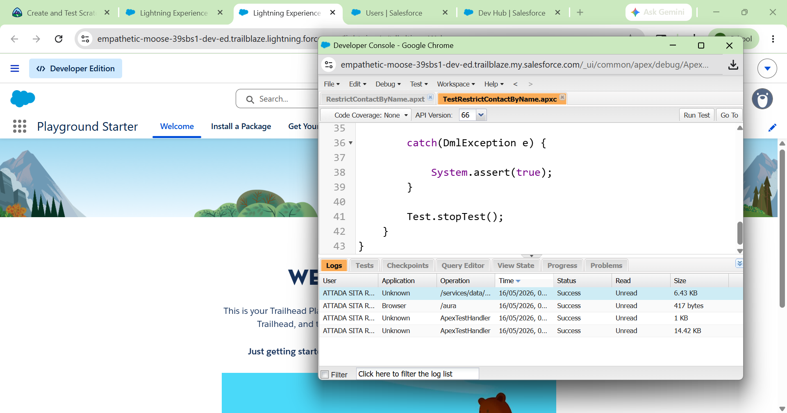
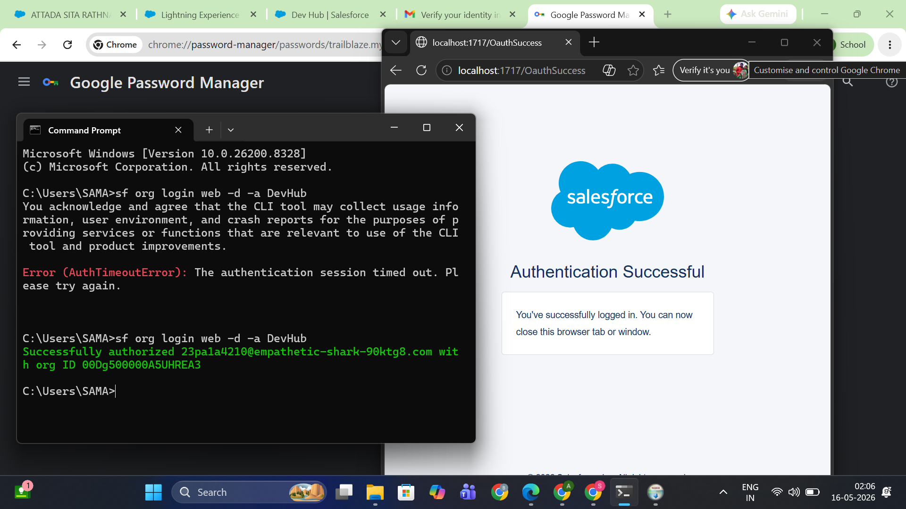
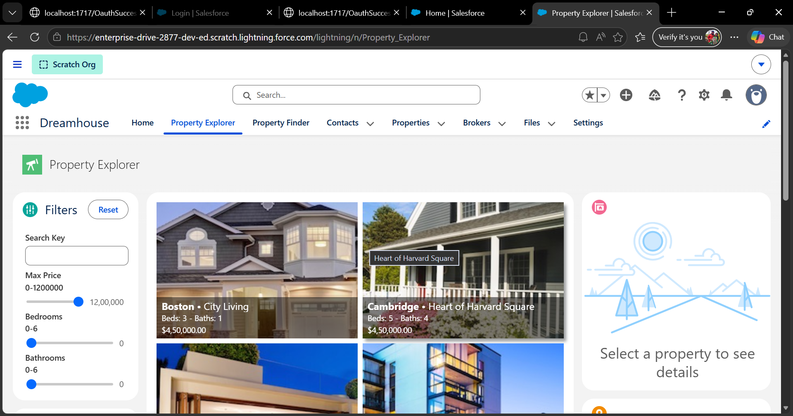

# Salesforce Summer Program - Week 1 Day 7

# 📌 Topics Covered

- Apex Testing
- Test Classes
- Code Coverage
- Asynchronous Apex
- Future Methods
- Queueable Apex
- Salesforce DX Workflow
- GitHub & Version Control
- CLI Workflow
- Enterprise Development Process

---

# 🧪 Why Testing Matters

Testing is very important in enterprise systems because organizations handle critical business data every day. A small bug can affect thousands of users, financial transactions, or customer records. Testing ensures that business logic works correctly before deployment.

In Salesforce, testing helps developers:
- Validate business logic
- Prevent production failures
- Improve reliability
- Maintain system stability
- Ensure safe deployments

Salesforce also requires minimum test coverage before deploying Apex code to production.

---

# ⚠️ Problems Without Testing

Without testing:
- Bugs may reach production
- Data may become incorrect
- Automation may fail unexpectedly
- Business operations may stop
- Users may lose trust in the system

Example:
If fee calculation logic is not tested properly, students may receive incorrect fee amounts.

---

# ⏳ What is Asynchronous Apex?

Asynchronous Apex allows processes to run in the background instead of making users wait for long operations to complete immediately.

It is used for:
- Large data processing
- External API calls
- Background automation
- Scheduled jobs

Asynchronous processing improves system performance and user experience.

---

# 🔄 Difference Between Synchronous and Asynchronous Processing

| Synchronous Processing | Asynchronous Processing |
|-----------------------|-------------------------|
| Executes immediately | Executes in background |
| User waits for completion | User can continue working |
| Suitable for small tasks | Suitable for long-running tasks |
| Faster response required | Heavy processing tasks |

---

# 🚀 Types of Asynchronous Apex

---

# 1. Future Methods

Future methods execute code asynchronously in the background.

### Use Cases:
- Sending notifications
- API integrations
- Background updates

### Example:
```apex
@future
public static void sendNotification() {

}
```

---

# 2. Queueable Apex

Queueable Apex allows developers to create background jobs with more flexibility and better monitoring.

### Advantages:
- Supports complex processing
- Can chain jobs
- Better than future methods for advanced scenarios

---

# 💻 What is Salesforce DX?

Salesforce DX (Developer Experience) is a modern development workflow that helps developers build, test, deploy, and manage Salesforce applications efficiently.

Salesforce DX includes:
- Scratch Orgs
- Salesforce CLI
- Source-driven development
- Git integration
- Continuous integration workflow

---

# 🛠 Why DX is Useful for Teams

Salesforce DX improves collaboration between developers by:
- Using version control
- Managing source code efficiently
- Supporting team development workflows
- Enabling faster deployments
- Improving testing and automation

---

# 🌿 Why Developers Use Version Control

Version control helps developers:
- Track code changes
- Collaborate safely
- Restore previous versions
- Avoid overwriting team members’ work

It is essential for large development teams.

---

# 🌍 Why GitHub is Important

GitHub is a platform used to store and manage source code repositories.

It helps teams:
- Collaborate on projects
- Track development history
- Review code changes
- Manage branches and workflows

GitHub is widely used in professional software development.

---

# ⚡ Command-Line Interface (CLI)

Salesforce CLI allows developers to interact with Salesforce using terminal commands instead of only browser clicks.

### Benefits:
- Faster workflow
- Automation support
- Scratch org management
- Deployment automation
- Better productivity

---

# 🏫 Complete System Workflow (College Management System)

---

# 1. CRM Layer

The College Management System manages:
- Students
- Faculty
- Courses
- Admissions
- Attendance
- Fee Payments

---

# 2. Objects

| Object | Purpose |
|--------|---------|
| Student | Student details |
| Course | Course information |
| Faculty | Faculty details |
| Admission | Admission workflow |

---

# 3. Relationships

- Student ↔ Course
- Faculty ↔ Course
- Student ↔ Attendance

Relationships help organize connected data properly.

---

# 4. Validation Rules

Validation Rules ensure data correctness.

### Examples:
- Email should not be empty
- Attendance cannot exceed 100%
- Fee amount cannot be negative

---

# 5. Flows

Flows automate simple business processes.

### Examples:
- Send welcome email
- Create admission tasks
- Update status automatically

---

# 6. Apex Triggers

Triggers handle advanced event-driven logic.

### Examples:
- Verify eligibility before placement registration
- Auto-create follow-up records
- Process advanced calculations

---

# 7. Asynchronous Apex

Used for background operations.

### Examples:
- Bulk email sending
- Payment gateway integration
- Report generation

---

# 8. Testing

Test classes verify:
- Business logic
- Automation
- Triggers
- Validation behavior

---

# 9. GitHub + DX Workflow

Developers:
- Create scratch orgs
- Develop features
- Push code to GitHub
- Test changes
- Deploy safely

---

# 🔄 How Flows, Triggers and Validation Rules Work Together

Validation Rules first ensure data is correct.

Then:
- Flows automate simple processes
- Triggers execute advanced business logic
- Asynchronous Apex handles background operations

Together, they create a complete enterprise automation system.

---

# 🧪 Important Test Cases

---

## Test Case 1 — Invalid Student Registration

### Scenario:
Student email is empty.

### Expected Result:
Validation Rule blocks record creation.

---

## Test Case 2 — Placement Eligibility

### Scenario:
Attendance below 75%.

### Expected Result:
Trigger blocks placement registration.

---

## Test Case 3 — Fee Payment Notification

### Scenario:
Fee payment completed.

### Expected Result:
Flow sends confirmation email automatically.

---

## Test Case 4 — Background Report Processing

### Scenario:
Large attendance report generation.

### Expected Result:
Queueable Apex processes report asynchronously.

---

## Test Case 5 — Bulk Student Import

### Scenario:
Import 500 student records.

### Expected Result:
Triggers process records without governor limit errors.

---

# 🤔 Reflection

Enterprise software development requires structured workflows because large systems involve:
- Multiple developers
- Complex business logic
- Continuous updates
- Huge amounts of data

Without proper workflows, systems become difficult to maintain, test, and scale.

Salesforce DX, GitHub, testing, CLI tools, Flows, Triggers, and Asynchronous Apex together create a professional development environment that improves reliability, collaboration, automation, and deployment efficiency.

---

# ✍️ Revision Questions & Answers

---

## 1. Why are tests important in enterprise systems?

Tests ensure business logic works correctly and prevent production failures.

---

## 2. What problems happen without testing?

Bugs, data corruption, automation failures, and unstable systems may occur.

---

## 3. Why is asynchronous processing useful?

It allows heavy tasks to run in the background without affecting user experience.

---

## 4. Difference between synchronous and asynchronous processing?

Synchronous processing runs immediately, while asynchronous processing runs in the background.

---

## 5. Why do developers use version control?

To track changes, collaborate safely, and manage source code efficiently.

---

## 6. Why is GitHub important?

GitHub supports collaboration, repository management, and development workflows.

---

## 7. Why is DX useful for teams?

DX improves collaboration, deployment, testing, and source-driven development.

---

## 8. How do Flows, Triggers and Validation Rules work together?

Validation Rules verify data, Flows automate simple tasks, and Triggers handle advanced logic.

---

## 9. Why should business logic be tested carefully?

Incorrect business logic can cause major operational and financial issues.

---

## 10. Why is developer workflow important in large teams?

Structured workflows improve collaboration, maintainability, and deployment reliability.

---

# 📸 Screenshots

## Apex Test Class


## Salesforce CLI


## Scratch Org


---

# 🛠 Tools Used

- Salesforce Trailhead
- Salesforce CLI
- Git & GitHub
- Scratch Orgs
- Apex Testing
- Salesforce DX
- Developer Console

---

# 📚 Key Learnings

- Understood why testing is essential
- Learned asynchronous processing concepts
- Explored Future Methods and Queueable Apex
- Understood Salesforce DX workflow
- Learned importance of GitHub and version control
- Connected Flows, Triggers, Validation Rules, and Testing together
- Understood professional enterprise development workflow

---

# 🎯 Outcome

Successfully understood how professional Salesforce development workflows combine testing, asynchronous processing, DX, GitHub, CLI tools, Flows, Triggers, and automation to build scalable and reliable enterprise applications.
